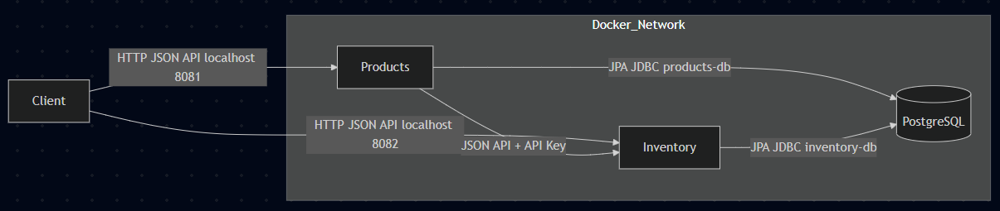
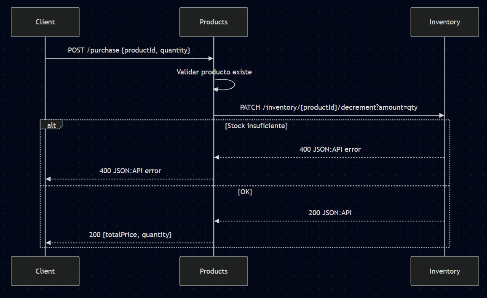

## Prueba Técnica – Microservicios Products e Inventory (Java / Spring Boot)


### Decisiones técnicas y justificación del endpoint de compra
- ¿Dónde vive el endpoint de compra? En `products`.
  - Responsabilidad y experiencia de cliente: la compra es un caso de uso del dominio de productos; `products` orquesta la operación y expone la API al cliente.
  - Bajo acoplamiento y foco en inventario: `inventory` se mantiene como servicio de estado de stock con operaciones atómicas (get, set, decrement), sin lógica de orquestación de negocio.
  - Consistencia y simplicidad: el flujo hace 1) validar existencia del producto en `products`, 2) decrementar stock en `inventory` de forma atómica, 3) responder con JSON:API con totales. Si no hay stock suficiente, `inventory` responde 400 y `products` lo propaga tal cual.
  - Evolución futura: `products` es el punto natural para añadir idempotencia (p.ej., cabecera Idempotency-Key), reintentos compensados y antifraude sin contaminar la lógica de `inventory`.

- Manejo de errores (JSON:API):
  - 404 Not Found: producto inexistente (validado en `products`).
  - 400 Bad Request: stock insuficiente (emitido por `inventory` y propagado por `products`).
  - 422 Unprocessable Entity: validaciones de payload.
  - Todos devuelven cuerpo JSON:API consistente.

- Comunicación y seguridad:
  - HTTP JSON:API entre servicios usando `RestClient`.
  - API Key vía cabecera configurable por perfil/entorno.
  - Timeouts y reintentos básicos configurables; se evita reintentar compras sin idempotencia para no duplicar operaciones.

- Base de datos: SQL (PostgreSQL)
  - Justificación: modelo relacional claro (productos–inventario), integridad referencial, transacciones y consultas maduras. En este alcance NoSQL no aporta ventaja.
  - Cada microservicio apunta a la misma instancia de PostgreSQL en Docker, con bases separadas (`products_db` e `inventory_db`).
- **Swagger**: habilitado en contenedores para facilitar pruebas manuales.
### Requisitos previos
- Docker y Docker Compose v2 instalados

### Instalación y ejecución (100% Docker)
1) Clonar el repositorio
```bash
git clone https://github.com/JhonnSantiagoBernalJuradoCampus/prueba-microservicios-java.git
cd prueba-microservicios-java
```
2) Construir imágenes e iniciar servicios
```bash
docker compose build
docker compose up -d
```
3) Comprobar estado
```bash
docker compose ps
```

### Swagger
- Products: `http://localhost:8081/swagger-ui/index.html`
- Inventory: `http://localhost:8082/swagger-ui/index.html`

### Autenticación
- Cabecera: `X-API-Key: prod-secret`

### Acciones en Swagger (endpoints)
- Products (Swagger UI de Products)
  - Crear producto: POST `/products`
  - Obtener producto: GET `/products/{id}`
  - Listar productos: GET `/products`
  - Comprar: POST `/purchase`
- Inventory (Swagger UI de Inventory)
  - Consultar cantidad: GET `/inventory/{productId}`
  - Establecer cantidad: PATCH `/inventory/{productId}` (JSON:API body)
  - Decrementar cantidad: PATCH `/inventory/{productId}/decrement?amount={n}`

### Health
- `http://localhost:8081/actuator/health`, `http://localhost:8082/actuator/health`

### Variables de entorno (definidas en docker-compose.yml)
- `products`: `DB_*`, `SECURITY_API_KEY_VALUE`, `INVENTORY_BASE_URL`, `INVENTORY_API_KEY_VALUE`
- `inventory`: `DB_*`, `SECURITY_API_KEY_VALUE`

### Diagramas

#### Diagrama de Arquitectura



#### Diagrama del Flujo de Compra



### Pruebas en Docker
```bash
docker compose run --rm tests sh -c
```
Ejecuta ahi mismo este comando
```bash
mvn -B -Dspring.profiles.active=test -f services/products/pom.xml test && mvn -B -Dspring.profiles.active=test -f services/inventory/pom.xml test
```
Ejecuta tests de `products` e `inventory` (perfil `test`).


### Uso de herramientas de IA Cursor
- Herramientas empleadas: asistente de IA para scaffolding de Spring Boot, generación de DTOs/MapStruct, envoltorios JSON:API, filtros de API Key y configuración Docker/Docker Compose.
- Tareas aceleradas: creación de clases repetitivas (DTOs, mappers), configuración de dependencias, esqueletos de controladores/servicios y pruebas (MockMvc e integración).
- Verificación de calidad del código generado:
  - Pruebas unitarias y de integración por microservicio (también ejecutables dentro de Docker con el servicio `tests`).
  - Validación manual con Swagger dentro de los contenedores (`/swagger-ui`).
  - Revisión de cumplimiento JSON:API en `data`/`errors` 
  - Construcción multi-stage y arranque con `docker compose up` para asegurar reproducibilidad.


